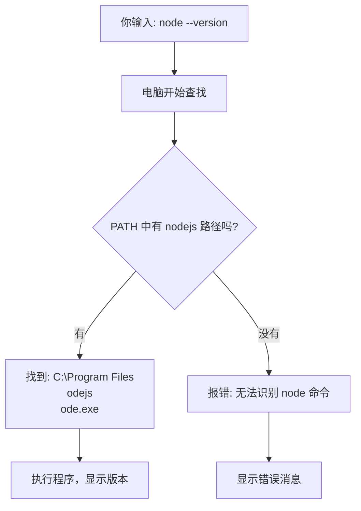
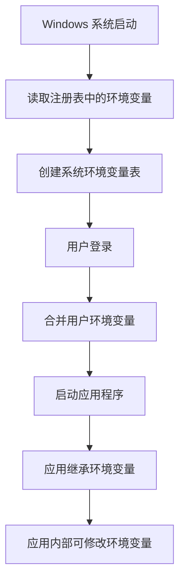

# 环境变量详解 - 从零开始理解

## 🤔 什么是环境变量？

### 生活中的比喻

**环境变量就像家里的"便民信息表"**

想象您家冰箱上贴着一张纸条：
```
📋 家庭便民信息表
├── 🏥 医院电话：120
├── 🚒 消防电话：119  
├── 🍕 常点外卖：1234567
├── 🔧 修理师傅：9876543
└── 📚 孩子学校：5555555
```

**当家人需要服务时**：
- 妈妈说："叫个外卖" → 查表找到外卖电话 → 拨打
- 爸爸说："找修理工" → 查表找到师傅电话 → 拨打

**环境变量就是电脑的"便民信息表"**：
- 你输入："运行 node" → 电脑查 PATH 表找到 Node.js 位置 → 执行
- 你输入："打开 git" → 电脑查 PATH 表找到 Git 位置 → 执行

---

## 💻 电脑中的环境变量

### PATH - 最重要的环境变量

**PATH 就是"程序地址簿"**

```
PATH 环境变量 = "程序在哪里"的清单
├── C:\Windows\System32          ← Windows 基本命令
├── C:\Program Files\nodejs      ← Node.js 程序  
├── C:\Program Files\Git\bin     ← Git 程序
├── C:\Python39                  ← Python 程序
└── ... 更多程序位置...
```

### 其他常见环境变量

```
USERNAME = "odoka"                    ← 当前用户名
TEMP = "C:\Users\odoka\AppData\Local\Temp"  ← 临时文件夹
HOME = "C:\Users\odoka"               ← 用户主目录  
WINDIR = "C:\Windows"                 ← Windows 系统目录
```

---

## 🔍 环境变量的工作原理

### 当你输入命令时发生什么？



### 详细步骤解析

**第1步：命令解析**
```
你输入：node --version
电脑理解：需要找一个叫 "node" 的程序
```

**第2步：查找程序**
```
电脑查看 PATH：
├── 在 C:\Windows\System32 找 node.exe？        ❌ 没有
├── 在 C:\Program Files\nodejs 找 node.exe？   ✅ 找到了！
└── 路径：C:\Program Files\nodejs\node.exe
```

**第3步：执行程序**
```
运行：C:\Program Files\nodejs\node.exe --version
结果：v22.18.0
```

---

## 🏠 环境变量的"级别"

### 想象成家庭规则的层次

#### 1. 系统级（家规）
```
🏢 适用于：所有用户（全家人都要遵守）
📝 设置位置：控制面板 → 系统 → 高级系统设置
🔧 需要权限：管理员权限
💾 存储位置：注册表系统区域

例子：PATH = "C:\Windows\System32;C:\Program Files\nodejs"
```

#### 2. 用户级（个人规则）  
```
👤 适用于：当前用户（只有你要遵守）
📝 设置位置：控制面板 → 用户账户
🔧 需要权限：普通用户权限
💾 存储位置：注册表用户区域

例子：PATH = "C:\Users\odoka\.local\bin"
```

#### 3. 进程级（临时规则）
```
⏱️ 适用于：当前程序运行期间
📝 设置方法：程序内部设置
🔧 需要权限：无需特殊权限
💾 存储位置：内存中（重启后消失）

例子：在 PowerShell 中执行 $env:PATH += ";新路径"
```

### 优先级规则

```
最终的 PATH = 系统级 PATH + 用户级 PATH + 进程级 PATH

例子：
系统级：C:\Windows\System32;C:\Program Files\nodejs
用户级：C:\Users\odoka\.local\bin  
进程级：C:\temp\tools

最终结果：
C:\Windows\System32;C:\Program Files\nodejs;C:\Users\odoka\.local\bin;C:\temp\tools
```

---

## 🛠️ 实际操作演示

### 查看环境变量

#### 方法1：PowerShell 查看
```powershell
# 查看 PATH 环境变量
$env:PATH

# 查看所有环境变量
Get-ChildItem Env:

# 查看特定变量
$env:USERNAME
$env:TEMP
```

#### 方法2：图形界面查看
```
1. Win + X → 系统
2. 高级系统设置  
3. 环境变量
4. 查看系统变量和用户变量
```

### 修改环境变量

#### 临时修改（重启后失效）
```powershell
# 添加新路径到 PATH
$env:PATH += ";C:\新程序\bin"

# 设置新的环境变量
$env:MY_APP_PATH = "C:\MyApp"

# 查看修改结果
$env:PATH
$env:MY_APP_PATH
```

#### 永久修改（用户级）
```powershell
# 使用 .NET 方法永久设置
[Environment]::SetEnvironmentVariable('PATH', $env:PATH + ';C:\新程序\bin', 'User')

# 设置自定义变量
[Environment]::SetEnvironmentVariable('MY_APP_PATH', 'C:\MyApp', 'User')
```

#### 永久修改（系统级，需管理员）
```powershell
# 需要管理员权限
[Environment]::SetEnvironmentVariable('PATH', $env:PATH + ';C:\新程序\bin', 'Machine')
```

---

## 🔄 环境变量的生命周期

### 环境变量如何传递？



### 实际例子

```
1. 系统启动时
   PATH = "C:\Windows\System32"

2. 用户登录后  
   PATH = "C:\Windows\System32;C:\Users\odoka\.local\bin"

3. 启动 Cursor IDE
   Cursor 继承：PATH = "C:\Windows\System32;C:\Users\odoka\.local\bin"

4. 在 Cursor 中打开终端
   终端继承 Cursor 的 PATH

5. 在终端中临时修改
   $env:PATH += ";C:\Program Files\nodejs"
   现在 PATH = "C:\Windows\System32;C:\Users\odoka\.local\bin;C:\Program Files\nodejs"
```

---

## 🚨 常见问题和解决方案

### 问题1：程序明明安装了，为什么找不到？

**原因**：程序路径不在 PATH 中
```powershell
# 检查程序是否存在
Test-Path "C:\Program Files\nodejs\node.exe"  # True

# 检查 PATH 中是否包含
$env:PATH -split ';' | Where-Object { $_ -like "*nodejs*" }  # 空结果
```

**解决**：添加程序路径到 PATH
```powershell
$env:PATH += ";C:\Program Files\nodejs"
```

### 问题2：为什么重启后设置失效？

**原因**：使用了临时修改方法
```powershell
# ❌ 这是临时的，重启后消失
$env:PATH += ";新路径"
```

**解决**：使用永久修改方法
```powershell
# ✅ 这是永久的
[Environment]::SetEnvironmentVariable('PATH', $env:PATH + ';新路径', 'User')
```

### 问题3：为什么有些程序能用有些不能？

**检查环境变量完整性**：
```powershell
# 创建检查脚本
$programs = @{
    'node' = 'C:\Program Files\nodejs'
    'git' = 'C:\Program Files\Git\bin'
    'python' = 'C:\Python39'
}

foreach ($prog in $programs.GetEnumerator()) {
    $exists = Test-Path $prog.Value
    $inPath = $env:PATH -like "*$($prog.Value)*"
    Write-Host "$($prog.Key): 已安装=$exists, 在PATH中=$inPath"
}
```

---

## 📋 环境变量最佳实践

### 设置原则

#### 1. 安装程序时的检查清单
```
✅ 程序是否提供"添加到 PATH"选项？
✅ 安装后是否验证命令可用？  
✅ 是否需要重启 IDE 来刷新环境变量？
```

#### 2. 环境变量管理规范
```
🎯 系统级：放置所有用户都需要的程序
👤 用户级：放置个人专用的工具
⚡ 临时级：仅用于调试和测试
```

#### 3. 路径格式规范
```
✅ 正确：C:\Program Files\nodejs
❌ 错误：C:\Program Files\nodejs\（多余的反斜杠）
❌ 错误：C:\Program Files\nodejs;（末尾有分号）
```

### 维护脚本

创建环境变量健康检查脚本：
```powershell
# env-health-check.ps1
Write-Host "🔍 环境变量健康检查" -ForegroundColor Cyan

# 检查 PATH 长度（Windows 限制约 8192 字符）
$pathLength = $env:PATH.Length
Write-Host "PATH 总长度: $pathLength 字符" -ForegroundColor Yellow
if ($pathLength -gt 7000) {
    Write-Warning "PATH 过长，可能导致问题"
}

# 检查重复路径
$paths = $env:PATH -split ';' | Where-Object { $_ -ne '' }
$uniquePaths = $paths | Sort-Object -Unique
$duplicates = $paths.Count - $uniquePaths.Count
if ($duplicates -gt 0) {
    Write-Warning "发现 $duplicates 个重复路径"
}

# 检查无效路径
Write-Host "`n无效路径检查:" -ForegroundColor Green
$paths | ForEach-Object {
    if (-not (Test-Path $_)) {
        Write-Host "  ❌ $_" -ForegroundColor Red
    }
}

Write-Host "`n✅ 健康检查完成" -ForegroundColor Green
```

---

## 🎓 总结 - 环境变量核心要点

### 简单记忆法

1. **环境变量 = 电脑的"便民手册"**
   - PATH = "程序在哪里"的地址簿
   - 其他变量 = 各种系统设置

2. **三个级别：系统 → 用户 → 进程**
   - 系统级：所有人共享，需管理员权限
   - 用户级：个人专用，普通权限即可
   - 进程级：临时使用，重启后消失

3. **修改方式**
   - 临时：`$env:变量名 = "值"`（重启后失效）
   - 永久：`[Environment]::SetEnvironmentVariable()`

4. **常见问题**
   - 程序找不到 → 检查 PATH
   - 设置失效 → 使用永久修改方法
   - IDE 问题 → 重启 IDE 刷新环境变量

### 实用命令速查

```powershell
# 查看所有环境变量
Get-ChildItem Env:

# 查看 PATH  
$env:PATH -split ';'

# 临时添加路径
$env:PATH += ";新路径"

# 永久添加路径（用户级）
[Environment]::SetEnvironmentVariable('PATH', $env:PATH + ';新路径', 'User')

# 测试命令是否可用
Get-Command 命令名 -ErrorAction SilentlyContinue
```

**现在您应该完全理解环境变量了！** 它就是电脑的"信息查询表"，帮助系统找到各种程序和设置。
