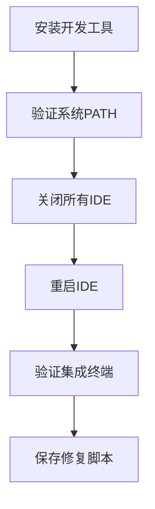

# IDE 终端类型详解 - 从零开始理解

## 🤔 什么是终端？

**简单理解**：终端就是一个"黑色窗口"，你可以在里面输入文字命令来操作计算机，就像用鼠标点击一样，但是用打字的方式。

比如：
- 鼠标操作：双击文件夹 → 打开文件夹
- 终端操作：输入 `cd 文件夹名` → 打开文件夹

---

## 🖥️ Windows 系统中的各种终端

### 1. 命令提示符 (CMD)
```
C:\Users\odoka> 
```
- **特点**：Windows 最古老的终端，黑底白字
- **用途**：执行基本的 Windows 命令
- **启动**：Win+R → 输入 `cmd` → 回车

### 2. PowerShell
```
PS C:\Users\odoka> 
```
- **特点**：微软的现代终端，功能更强大
- **用途**：除了基本命令，还支持复杂的脚本
- **启动**：Win+X → 选择 "Windows PowerShell"

### 3. Windows Terminal (新终端)
- **特点**：微软最新的终端应用，界面漂亮
- **用途**：可以同时运行 CMD、PowerShell、WSL 等
- **安装**：从微软商店下载

---

## 🎨 IDE 集成终端 vs 独立终端

### 独立终端（系统自带）
```
直接从开始菜单打开
┌─────────────────────────────────────┐
│ PS C:\Users\odoka>                  │
│                                     │
│                                     │
│                                     │
└─────────────────────────────────────┘
```

### IDE 集成终端（内置在编辑器中）
```
在 Cursor/VSCode 底部的终端面板
┌─────────────────────────────────────┐
│ 代码编辑区域                          │
├─────────────────────────────────────┤
│ PS C:\path\to\project>              │  ← 这就是集成终端
│                                     │
└─────────────────────────────────────┘
```

---

## 🔍 为什么会有环境变量问题？

### 环境变量就像"电话簿"

想象环境变量 PATH 就像手机里的电话簿：

```
PATH = "电话簿"
├── C:\Program Files\nodejs     ← node 命令的"电话号码"
├── C:\Program Files\Git\bin    ← git 命令的"电话号码"  
└── ...更多程序的路径...
```

**当你输入命令时**：
1. 你说："请找 `node`"
2. 终端查看 PATH "电话簿"
3. 如果找到 `C:\Program Files\nodejs`，就执行
4. 如果找不到，就说"无法识别该命令"

### 问题发生的过程


**用生活例子解释**：
1. 你新买了手机，号码是 123456
2. 你把号码告诉了家里的座机电话簿
3. 但是你朋友的手机里还是旧电话簿，没有你的新号码
4. 所以朋友打不通你的电话

**对应到电脑**：
1. 安装了 Node.js (新手机号码)
2. 系统环境变量更新了 (家里电话簿更新)
3. 但 Cursor IDE 还在用旧的环境变量 (朋友手机里的旧电话簿)
4. 所以找不到 node 命令

---

## 🛠️ 各种终端的区别详解

### 启动方式和环境继承

#### 1. 系统独立终端
```
你直接打开 PowerShell
↓
自动获取最新的系统环境变量
↓  
PATH 包含所有已安装程序的路径
↓
命令都能正常工作 ✅
```

#### 2. IDE 集成终端  
```
你打开 Cursor IDE
↓
Cursor 从系统继承环境变量（当时的快照）
↓
你在 Cursor 里打开终端
↓
终端从 Cursor 继承环境变量
↓
如果 Cursor 的环境变量是旧的，终端也是旧的 ❌
```

### 可视化对比

| 特性 | 独立 PowerShell | Cursor 集成终端 |
|-----|----------------|----------------|
| **环境变量更新** | 🔄 每次启动都是最新 | ❄️ 固定在 Cursor 启动时 |
| **工作目录** | 🏠 用户主目录 | 📁 项目根目录 |
| **便利性** | ⚖️ 需要切换窗口 | ✅ 代码和终端一体 |
| **功能完整性** | ✅ 完整系统功能 | ❓ 取决于 IDE 集成度 |

---

## 💡 实际操作示例

### 测试环境变量差异

**在独立 PowerShell 中**：
```powershell
# 1. Win+X，选择 "Windows PowerShell"
# 2. 输入以下命令
$env:PATH -split ';' | Where-Object { $_ -like "*nodejs*" }
# 结果：C:\Program Files\nodejs ✅

node --version  
# 结果：v22.18.0 ✅
```

**在 Cursor 集成终端中（修复前）**：
```powershell
# 1. 在 Cursor 中按 Ctrl+` 打开终端  
# 2. 输入相同命令
$env:PATH -split ';' | Where-Object { $_ -like "*nodejs*" }
# 结果：(空) ❌

node --version
# 结果：无法将"node"项识别为... ❌
```

### 修复过程演示

```powershell
# 第1步：确认问题
PS> node --version
# ❌ 无法识别命令

# 第2步：查看当前 PATH
PS> $env:PATH -split ';' | findstr nodejs
# ❌ 没有输出（说明 PATH 中没有 nodejs）

# 第3步：手动添加路径
PS> $env:PATH += ";C:\Program Files\nodejs"

# 第4步：再次测试
PS> node --version  
# ✅ v22.18.0

# 第5步：验证 PATH 更新
PS> $env:PATH -split ';' | findstr nodejs
# ✅ C:\Program Files\nodejs
```

---

## 🔧 终端选择建议

### 何时使用独立终端

**适合场景**：
- ✅ 系统管理任务
- ✅ 安装全局工具
- ✅ 环境变量有问题时的诊断
- ✅ 需要管理员权限的操作

**启动方法**：
```
Win+X → Windows PowerShell (管理员)
或
Win+R → powershell → 回车
```

### 何时使用 IDE 集成终端

**适合场景**：
- ✅ 日常开发工作
- ✅ 项目相关命令（npm, git）
- ✅ 需要频繁在代码和终端间切换
- ✅ 运行构建和测试命令

**启动方法**：
```
在 Cursor 中按 Ctrl+`
或
菜单：View → Terminal
```

---

## 🚀 最佳实践

### 开发环境设置流程



**具体步骤**：

1. **安装阶段**
   ```bash
   # 安装 Node.js 时确保勾选 "Add to PATH"
   # 或者手动添加到系统环境变量
   ```

2. **验证阶段**
   ```powershell
   # 在独立 PowerShell 中测试
   node --version
   npm --version
   git --version
   ```

3. **IDE 重启**
   ```
   完全关闭 Cursor → 重新启动 → 测试集成终端
   ```

4. **应急准备**
   ```powershell
   # 保存快速修复命令
   $env:PATH += ";C:\Program Files\nodejs;C:\Program Files\Git\bin"
   ```

### 日常使用建议

| 任务类型 | 推荐终端 | 原因 |
|---------|---------|------|
| 🔧 安装全局包 | 独立 PowerShell | 需要管理员权限 |
| 📁 项目开发 | Cursor 集成终端 | 便于代码调试 |
| 🚨 故障诊断 | 独立 PowerShell | 环境最纯净 |
| ⚡ 快速测试 | 任一终端 | 看个人习惯 |

---

## 💭 常见误区澄清

### ❌ 误区1："所有终端都一样"
**事实**：不同终端的环境变量可能不同，特别是 IDE 集成终端。

### ❌ 误区2："命令不能用就是没安装"  
**事实**：程序可能已安装，只是 PATH 环境变量中找不到路径。

### ❌ 误区3："重启电脑就能解决"
**事实**：重启 IDE 通常就够了，不需要重启整个系统。

### ❌ 误区4："集成终端功能不完整"
**事实**：集成终端功能完整，只是环境变量继承机制不同。

---

**希望这个解释能让您彻底理解终端的区别和工作原理！** 

如果还有任何不清楚的地方，请告诉我具体哪个概念需要进一步解释。
